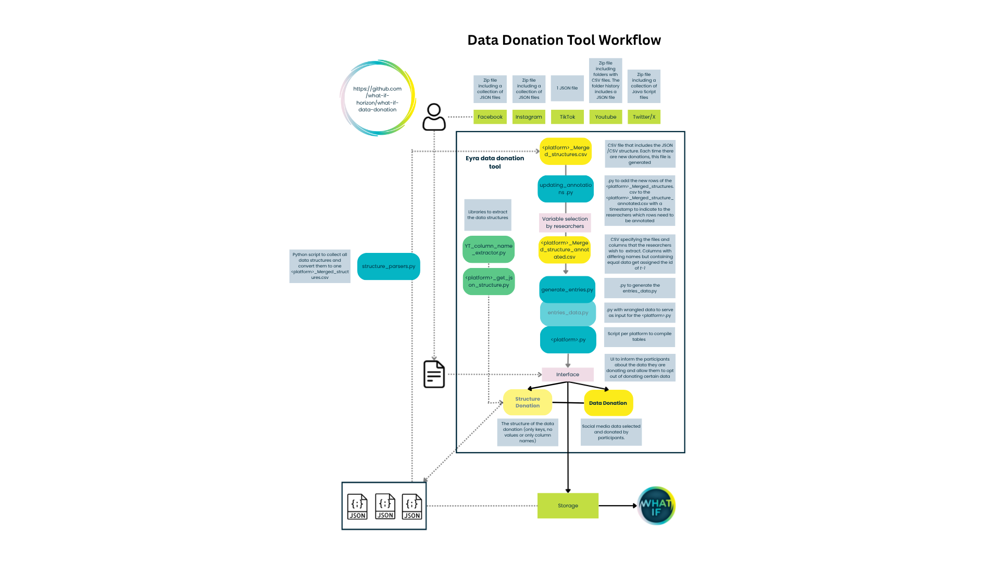

# How to use and implement this data donation tool
This data donation tool in an extension of the Feldspar repository which can be implemented in the Eyra environment to collect data donations. The aim of this extension in to collect data donations with the highest standards for data privacy while reducing the risk of omitted variables or unnecessary data loss as much as possible. This documentation serves as a step-by-step guide to first understand the rationale and the strategy behind each component of the tool and consequently lays out how to use and update the tool in the pre-production and the production phase.

## Workflow Data Donation Tool

 The workflow of this tool consists of four parts: 1. Data structure collection, 2.Processing of data structures, 3. Variable selection by researchers, and 4. Implementation of data donation tool. In short, the idea behind this tool is to obtain the data structures of social media takeouts to specifically inform the data donation tool running on the participant's local machine which data should be collected from their social media takeout. In this way, we avoid collecting highly personal, sensitive or unnecessary data. In this workflow description we will go trough the rationale behind each step, how to perform the step and how to asses the step in case of problems during the data collection. 

### 1. Data structure collection
- **Input**: Zip folder including JSON files (YT, FB, IG, X) or JSON (TT) containing the full data takeout
- **Output**: JSON containing the masked data structures 
#### The rationale
Social media takeout data contains highly sensitive and private data. Think about IP addresses, contact details and photos. Moreover, according to the article 5(1)(c) of the GDPR, which states: “Personal data shall be adequate, relevant and limited to what is necessary in relation to the purposes for which they are processed (‘data minimisation’).”, on other words, only data that will be of use for achieving the goal of the project should be collected. To do so, we need the exact variable names and as most data takeouts are provided in JSON format, the exact json paths to these variables,  to only collect data we intent to collect. Unfortunately, the social media takeout formats and structures are not consistent over time, location and platform. Hence, we need to collect a representative sample of these social media structures to properly select the variables we intend to collect and avoid unintentionally omitted variables. 

#### The strategy 
The strategy to collect the social media data takeout structures is rather simple. When participants upload their social media data takeout in the donation tool, all keys in te case of JSON and all column names in the case of CSVs are saved with the values masked through replacing the real data with a string specifying the data type (eg. 'string', 'boolean'). These data structures are then used to inform the data donation tool for the next iteration of collecting data using the tool. When there are no data structures available yet, we run a test round with a small but representative sample of participants to obtain these structures. During the data collection process, the data structures should be used to update the tool with the latests variables and paths. In the future, we hope that each data donation study will make the data structures publicly available to support new studies. 

#### The code
The python code which does the masking of real values in the social media can be found [here](https://github.com/what-if-horizon/what-if-data-donation/tree/master/structure_donations/Structure_extractor_libraries) in the GIT repository. There is a specific script for each of the social media platforms. The code recursively loops through all JSON files in the zip file (in case of multi-document takeouts) and consequently trough all values in the JSON, replacing them with a string indicating the data type.

### 2. Processing of data structures
- **Input**: JSONs containing the masked data structures per platform per participant
- **Output**: One CSV per platform containing the file paths to the different JSON files and the consequent JSON paths to the lowest key
#### The rationale
To comply with rules on informed consent we need to inform the participants clearly on what data they will be donating. As JSON files are not easily interpretable by humans, the data should be transformed to a more easily readable tabular format. To do so we need to obtain the full JSON path to each lowest level key to be able to transform the data to tabular format. Also, as only necessary and non highly sensitive or private data should be selected, the researcher needs to make decisions on exactly which data to obtain and which data to exclude. Due to differences in data takeout structures, the JSON paths might differ slightly but point to the same data. Therefore, we generate IDs for each data field that are easy to interpret for researchers. Using the IDs the researcher decides what data to collect.

#### The strategy
To obtain the full JSON path, a python script has been created for each platform separately as the JSON structure of each platform is different with its own challenges and quirks. Also, due to the deeply nested structures most existing libraries to extract JSON paths do not work. The processing output is a CSV file named [<'platform'>_Merged_Structures.csv](https://github.com/what-if-horizon/what-if-data-donation/tree/master/structure_donations/Processed_structure_donations) with the following columns:
- **json_name**: Name of the JSON file in which the JSON path can be found
- **id**: Unique ID for each data field. 
    - See below for more detail on the construction of the IDs
    - Note that due to slight differences in the JSON paths, identical data fields can have different IDs and hence need to be modified by hand
- **column_name**: The name of the lowest level key in the JSON path
- **path**: The full JSON path
- **list_path**: In case the value of a key is a list rather than a value, this column contains the JSON path until the list
- **subfield_path**: In case of a static path, this column contains the full JSON path. In case a list is included in the JSON path, the part of the JSON path enlisted is stored here. 
- **var_type**: Describes whether the variable is included in a list ('list') or is a regular variable ('static')
- **file_path**: Certain data takeouts are zipfiles consisting of a nested folder structure. The path to the JSON files are specified in this column. 
- **duplicate_flag**: In case there is an ID that is duplicated due to JSON paths containing keys holding identical information but different json paths. For example parts of the data can be enlisted whereas in other cases the data is not. When a duplicate ID is found, this ID is marked as 'Yes'

##### ID creation
###### Instagram
The ID for Instagram initially consist of the folder name in which the JSON is stored, the name of the json and the column name. In case this does not result into a unique ID, in the following iterations (max 4), json keys are added starting at the deepest level. If again this does not result in a unique ID, the folder one level higher is added to the ID as well. In other words the most minimal ID consist of lowest folder name + json name + column name. The maximum ID consist of the second lowest folder + lowest folder name + json name + key[1,2,3] + column name.

###### Facebook
The ID for Facebook initially consist of the folder name in which the JSON is stored, the name of the json and the column name. In case this does not result into a unique ID, in the following iterations (max 6), json keys are added starting at the deepest level. If again this does not result in a unique ID, the folder up until 3 levels higher is added to the ID as well. In other words the most minimal ID consist of lowest folder name + json name + column name. The maximum ID consist of the second lowest folder[1,2,3] + lowest folder name + json name + key[1,2,3] + column name.

###### TikTok
The ID for TikTok initially consist of the highest level key in combination with the lowest level key. If this does not result in an unique ID, more keys are added until the maximum number of keys present in the JSON is reached or a unique ID has been established. 

###### Twitter
The ID for Twitter initially consist of the name of the Java script file combined with the name of the lowest level key. In case this does not result in an unique ID, more keys are added starting at the deepest level until the maximum number of keys has been reached or an unique ID has been created.

###### Youtube 
**JSON**
The ID for the Youtube JSONs initially consist of the name of the Java script file combined with the name of the lowest level key. In case this does not result in an unique ID, more keys are added starting at the deepest level until the maximum number of keys has been reached or an unique ID has been created.
**CSV**
The ID for the Youtube CSV consist of the name of the CSV and the column name. 

#### The code
The jupyter notebooks to generate the <'platform'>_Merged_Structures.csv can be found [here](https://github.com/what-if-horizon/what-if-data-donation/tree/master/structure_donations/Parser_structures_to_schema_df) in the GIT repository. After loading the data structures, the code flattens the JSON while taking into account and labeling the enlisted JSON paths. This is done for each data structure independently after which the CSVs containing the flattened JSON files are merged and the IDs are generated. 

### 3. Variable selection by researchers
- **Input**: CSV per platform containing the merged data structures
- **Output**:  CSV per platform containing the merged data structures including a column KeepID containing the IDs of the variables that should be collected

#### The rationale 
As explained above only relevant non highly personal data should be collected. The decision of which variables to collect should be made by the researcher.

#### The strategy
The researcher merges new rows including a timestamp of the <'platform'>_Merged_Structures.csv to the [<'platform'>_Merged_Structures_Annotated.csv](https://github.com/what-if-horizon/what-if-data-donation/tree/master/structure_donations/Annotated_schema_df) using the he [Updating_merged_structures_annotated.ipynb](https://github.com/what-if-horizon/what-if-data-donation/blob/master/structure_donations/Updating_merged_structures/Updating_merged_structures_annotated.ipynb).  The researcher goes trough the new rows and pastes the ID in the 'KeepID' column in case she wishes to collect that variable. In case she finds different IDs pointing at the same data, she decides on the final ID and replaces the original ID. It is highly important that the row is kept with the new ID as the differing JSON path is important to maintain as to collect the variable correctly. 

#### The code
The [Updating_merged_structures_annotated.ipynb](https://github.com/what-if-horizon/what-if-data-donation/blob/master/structure_donations/Updating_merged_structures/Updating_merged_structures_annotated.ipynb) performs an anti-join between the <'platform'>_Merged_Structures_Annotated.csv and the newly generated <'platform'>_Merged_Structures.csv to indicate the new rows and provide a timestamp. Then, the new rows are appended to the [<'platform'>_Merged_Structures_Annotated.csv](https://github.com/what-if-horizon/what-if-data-donation/tree/master/structure_donations/Annotated_schema_df)

### 4. Implementation of data donation tool
- **Input**: Annotated merged structure CSVs
- **Output**: Data donations flattened into multiple interpretable tables 

#### The rationale
To make the data interpretable for the participants and give them a fair opportunity to opt out of the data they do not wish to donate, the JSONs need to be flattened into tables.

#### The strategy
The variables with an ID in the 'KeepID' column in the `[<'platform'>_Merged_Structures_Annotated.csv](https://github.com/what-if-horizon/what-if-data-donation/tree/master/structure_donations/Annotated_schema_df) are standardised and wrangled into a script which serves as input for the user interface and generates the tables. 

#### The code
The annotated merged structure CSVs are used as input to run the [generate_entries.py](https://github.com/what-if-horizon/what-if-data-donation/blob/master/structure_donations/generate_entries.py) (structure_donations/generate_entries.py) which outputs the entries_data.py. Only variables specified in the 'KeepID' column are included.  This generate_entries.py script serves as input for the [donation flow scripts](https://github.com/what-if-horizon/what-if-data-donation/tree/master/packages/python/port/donation_flows) which flatten the JSONs into tables and provide these tables to the participants in the user interface. 

## The Data Collection
Due to the novelty of the strategy applied in this data donation tool, we need to run through three different phases to collect sufficient data structures to execute the tool with minimal data loss. The phases are as follows:
1. **Pre-production phase**: In this phase we manually collect data takeouts and convert them into merged data structures. The merged structures are used to inform the tool on what and how to retrieve the data from the data takeouts. This is needed to be able to execute the tool for the test-production phase. The main goal of this phase is to design and test the tool. 
2. **Test phase**: As the manually collected data takeouts are not sufficient to capture all data structures for each platform, each country and over time, we do a test-production phase. The main goal of this phase is to collect a more representative sample of data structures and to test the functionality of the tool. During this phase the tool will be administered to a small but representative sample of respondents in each of the participating countries. 
3. **Production phase**: During this phase the tool will be administered to the full panel of participants who will donate their data takeouts. 

During the data collection, the data donation tool needs to be updated after each newly received batch of data donation This updating entails three main steps: 1. updating the the  <'platform'>_Merged_Structures.csv; 2. updating the  <platform>_Merged_Structures_Annotated.csv; 3. Rerun the generate_entries.py and 4. performing an end-to-end integration test.

### Pre-production phase
As the data donation tool needs masked data structures to be executed, before going into the test-production phase, some data takeouts have been manually collected, masked and used to create the merged data structures. As the pre-production phase cannot be done fully automated, the workflow for the pre-production phase is somewhat different than for the test-production and production phase.

#### 1. Masking the full data donations
1. Create a folder on your local machine named 'Raw' using this file path structure_donations/Processed_structure_donations/<'platform'>/Raw
    - The gitignores contains instructions to never push the 'Raw' folder to git to avoid accidental pushing of private and sensitive data to git
2. Execute the [structure_extractor_notebooks](https://github.com/what-if-horizon/what-if-data-donation/tree/master/structure_donations/Structure_extractor_notebooks) (structure_donations/Structure_extractor_notebooks)
3. Check the [masked data structures](https://github.com/what-if-horizon/what-if-data-donation/tree/master/structure_donations/Processed_structure_donations) (structure_donations/Processed_structure_donations/<'platform'>/Input)

#### 2. Updating the  <'platform'>_Merged_Structures.csv
1. Run the [Parser_structures_to_merged_structures](https://github.com/what-if-horizon/what-if-data-donation/tree/master/structure_donations/Parser_structures_to_merged_structures) notebooks (structure_donations/Parser_structures_to_merged_structures)

2. Check if the [merged structure csv](https://github.com/what-if-horizon/what-if-data-donation/tree/master/structure_donations/Processed_structure_donations) (structure_donations/Processed_structure_donations/<'platform'>/Final) has been updated correctly. 

#### 3. Updating the  <'platform'>_Merged_Structures_Annotated.csv
1. Execute the [Updating_merged_structures_annotated.ipynb](https://github.com/what-if-horizon/what-if-data-donation/blob/master/structure_donations/Updating_merged_structures/Updating_merged_structures_annotated.ipynb)
2. Check the [annotated merged structures](https://github.com/what-if-horizon/what-if-data-donation/tree/master/structure_donations/Annotated_Merged_Structures) (structure_donations/Annotated_Merged_Structures) to see if new rows are added
3. Copy the IDs from the variables that should be collected into the 'KeepID' column

#### 4. Rerun the generate_entries.py
Rerun the [generate_entries.py](https://github.com/what-if-horizon/what-if-data-donation/blob/master/structure_donations/generate_entries.py) (structure_donations/generate_entries.py) to update the entries_data.py 

### Test phase and Production phase
During the test phase and the production phase, the tool needs to be updated in regular intervals to obtain optimal benefit from the donated data structures.

#### 1. Obtain the newly donated data structures from the Yoda environment
NOT READY

#### 2. Updating the  <'platform'>_Merged_Structures.csv
1. Run the [Parser_structures_to_merged_structures](https://github.com/what-if-horizon/what-if-data-donation/tree/master/structure_donations/Parser_structures_to_merged_structures) notebooks (structure_donations/Parser_structures_to_merged_structures)

2. Check if the [merged structure csv](https://github.com/what-if-horizon/what-if-data-donation/tree/master/structure_donations/Processed_structure_donations) (structure_donations/Processed_structure_donations/<'platform'>/Final) has been updated correctly. 

#### 3. Updating the  <'platform'>_Merged_Structures_Annotated.csv
1. Execute the [Updating_merged_structures_annotated.ipynb](https://github.com/what-if-horizon/what-if-data-donation/blob/master/structure_donations/Updating_merged_structures/Updating_merged_structures_annotated.ipynb)
2. Check the [annotated merged structures](https://github.com/what-if-horizon/what-if-data-donation/tree/master/structure_donations/Annotated_Merged_Structures) (structure_donations/Annotated_Merged_Structures) to see if new rows are added
3. Copy the IDs from the variables that should be collected into the 'KeepID' column

#### 4. Rerun the generate_entries.py
Rerun the [generate_entries.py](https://github.com/what-if-horizon/what-if-data-donation/blob/master/structure_donations/generate_entries.py) (structure_donations/generate_entries.py) to update the entries_data.py 

#### 5. Perform an end-to-end integration test (NEED FIXES)

For a full explanation on how to run the end-to-end integration test, please click [here.](https://github.com/what-if-horizon/what-if-data-donation/blob/master/pytests/README.md)

